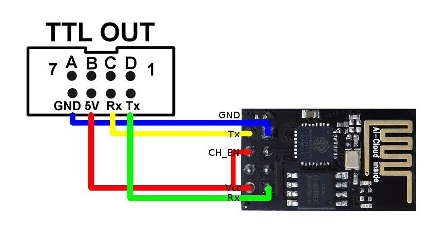

# espBode
Interface between a Siglent oscilloscope and FY6800 AWG

The idea bases on solution proposed by 4x1md in https://github.com/4x1md/sds1004x_bode

Currently implemented features:
 - ESP is able to connect to a selected WiFi network and listen to oscilloscope requests
 - After ESP sends request to AWG it waits for confirmation

TODO:
 - rewrite whole thing to C++, so adding new AWGs would be easier
 - add possibility to configure SSID/PSK + IP without flashing the new SW

**!WARNING! FY6800 VCC level is 5V, so it has to be dropped somehow to 3.3V ESP may release the magic smoke otherwise.**

